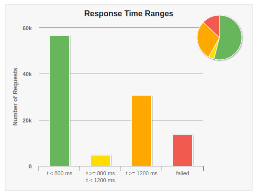
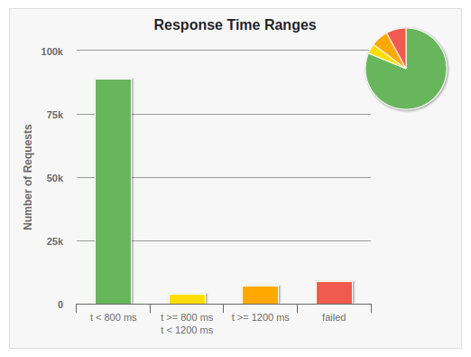

# RinhaDeBackend

This project was my participation in [Rinha de Backend](https://github.com/zanfranceschi/rinha-de-backend-2023-q3). The central idea was to build the most performatic API while adhering to some rules and run a stress test to determine which one performs better.

The API has 3 endpoints:

-   **POST**: /pessoas
    -   Performs body validations and creates the user in the database.
-   **GET**: /pessoas/id
    -   Searches for the person with that ID in the database.
-   **GET**: /pessoas?t=jo
    -   Searches for all users whose names, nicknames, or stacks contain "jo".

I made two completely different implementations:
- Usign Redis as a cache database:
	- Code available on "[redis-implementation](https://github.com/GuilhermeSAraujo/rinha-backend/tree/redis-implementation)" branch.
- Using pub/sub design pattern, with Nats server:
	- Code available on "[pub/sub-implementation](https://github.com/GuilhermeSAraujo/rinha-backend/tree/pub/sub-implementation)" branch.

## Comparison

> Redis implementation always on the left, pub/sub on the right.

### Inserts
The principal metric of the challenge was the users inserts on the database. Pub/sub implementation got this one.

Average inserts:
| Redis | Pub/Sub |
|--|--|
| 38880 | 40400 |

###  Responses success rate

| Redis | Pub/Sub |
|--|--|
|  |  |

### Response time ranges
| Redis | Pub/Sub |
|--|--|
|  |  |
